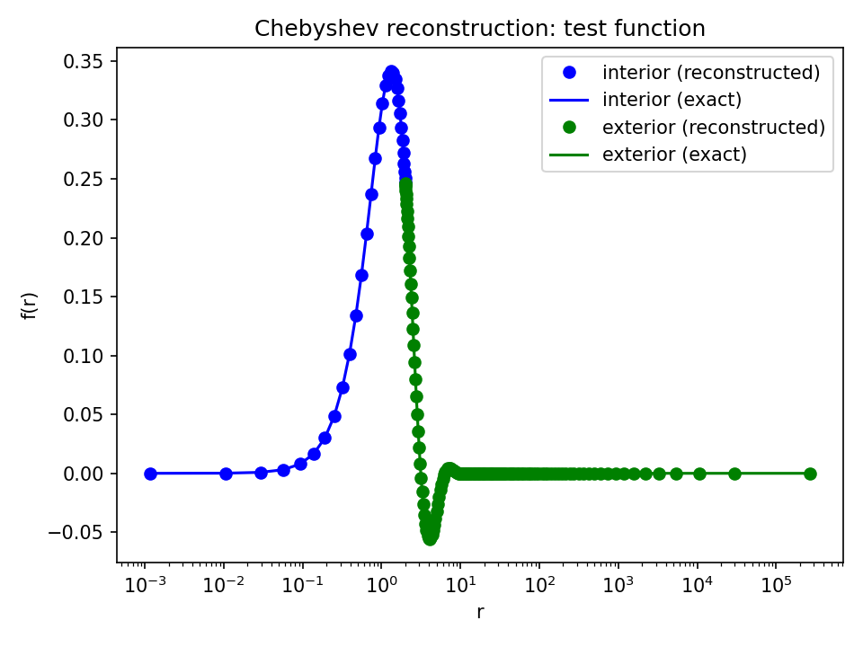
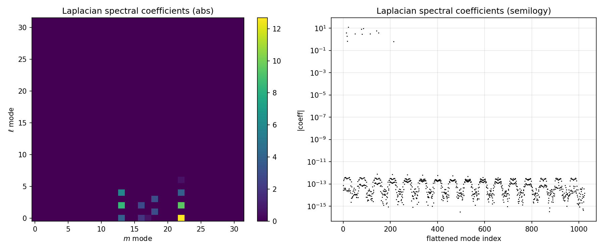
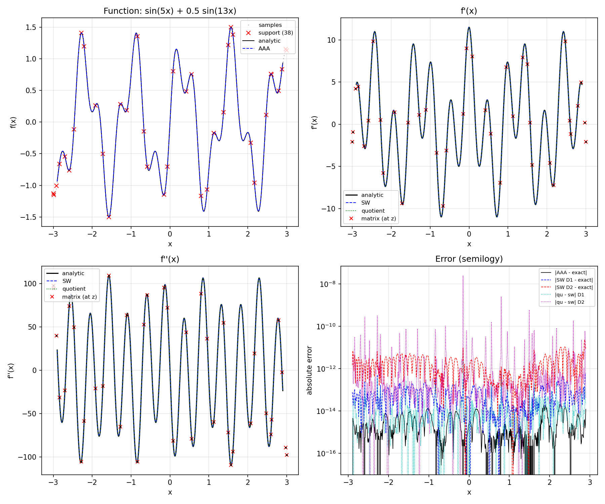
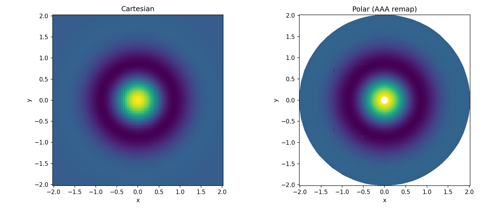
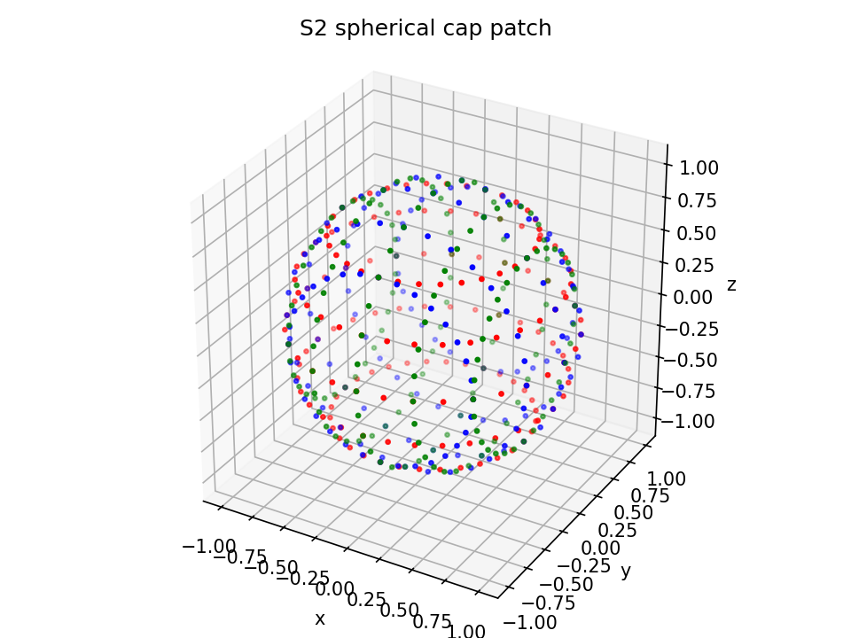

# pynalgo

Fully Numba-JIT-compiled toolkit for spectral methods, rational
approximation, and high-performance numerical computation.

**Author:** Boris Daszuta
**License:** BSD-3-Clause

Documentation: https://pynalgo.readthedocs.io

## Setup

```bash
export PYTHONPATH="/path/to/pynalgo:$PYTHONPATH"
```

Dependencies: `numpy`, `numba`, `scipy` (scipy used only via ctypes `gammaln`
bridge in Laguerre-lambda and Ultraspherical functions).

All public functions are Numba JIT-compiled at import time. First call
triggers compilation (1-5s for most functions, 60-120s for AAA with SVD).
All public functions are callable from both Python and nopython contexts.

## Module Families

| Family                | Modules                                               | Description                                  |
|-----------------------|-------------------------------------------------------|----------------------------------------------|
| Core utilities        | `pynalgo.common_tools`                                | JIT decorators, array utilities              |
| Spectral methods      | `pynalgo.spectral`, `pynalgo.differentiation`         | Polynomial bases, DCT, diff matrices         |
| Polynomials           | `pynalgo.special_functions`, `pynalgo.number_theory`  | Orthogonal polynomials, grids, gamma, primes |
| Integration & solvers | `pynalgo.integration`, `pynalgo.linear_algebra`, `pynalgo.root_finding` | Quadrature, tridiagonal/pentadiagonal, root finding |
| Rational approx       | `pynalgo.rational`                                    | AAA algorithm, derivatives, diff matrices    |
| Resampling            | `pynalgo.resample`                                    | Barycentric interpolation, smoothing         |
| FFT                   | `pynalgo.fft`                                         | Cooley-Tukey & Bluestein FFT (1D-4D)         |

## Grid Variety Convention

| Variety | Description   | Endpoints  |
|---------|---------------|------------|
| `GL`    | Gauss-Lobatto | Both       |
| `G`     | Gauss         | Neither    |
| `RL`    | Radau-left    | x = -1     |
| `RR`    | Radau-right   | x = +1     |

Fourier grids: `S1_CL`, `S1_CR`, `S1_I`, `H1_C`, `H1_I`, `H1_S`.

## Usage Examples

Run from the `usage/` directory. Each script produces figures.

### Chebyshev Grid Varieties

Four grid types for spectral collocation, each placing nodes at different
endpoints.

```python
from pynalgo import grid_ChebyshevT, poly_ChebyshevT

gr_GL = grid_ChebyshevT(4, variety="GL")   # both endpoints
gr_G  = grid_ChebyshevT(4, variety="G")    # interior roots only
gr_RR = grid_ChebyshevT(4, variety="RR")   # right endpoint
gr_RL = grid_ChebyshevT(4, variety="RL")   # left endpoint
```

<p align="center"></p>

`usage/chebyshev_grids.py`

### Multi-Domain Wave Equation in Spherical Symmetry

Chebyshev pseudospectral discretization with interior (Radau-right) and
exterior (Radau-left) domains connected by C0/C1/C2 matching. Exterior
compactification: r in [a, inf) mapped to x in [-1,1] via
r = a + L arctanh((x+1)/2). Orszag filtering, RK4 evolution.

<p align="center"></p>

*Chebyshev reconstruction across both domains.*

<p align="center"></p>

*Initial vs final profile after 10000-step RK4 evolution.*

`usage/wave_spherical_ps.py`

### Laplacian on S^2: Parity-Split vs Domain-Extension

Two approaches to the spherical Laplacian on Fourier grids. Spherical
harmonic test, RK4 wave evolution.

<p align="center"></p>

*Spectral coefficients should be sparse for spherical harmonics.*

`usage/laplacian_s2_ps.py`

### AAA Rational Approximation Derivatives

Three methods for computing derivatives of AAA barycentric rational
approximants: Schneider-Werner divided differences (stable near support
nodes), quotient rule, and differentiation matrix.

<p align="center"></p>

*Function (top-left), first derivative (top-right), second derivative
(bottom-left), absolute errors (bottom-right).*

`usage/rat_derivatives.py`

### Piecewise AAA with Automatic Domain Fission

When AAA error exceeds tolerance, the domain is bisected and AAA re-run
on each sub-interval. Recursive tree with overlap handling.

<p align="center"></p>

*Error plot for tanh(30x) with four leaf blocks. Red lines mark block
boundaries.*

`usage/function_block.py`

### Cartesian-to-Polar Coordinate Remap

Maps a planar function onto a polar grid using 1D AAA along radial slices.

<p align="center"></p>

*Left: Cartesian source. Right: polar remap with AAA along each ray.*

`usage/planar_remap.py`

### 2D Dimension-Split Rational Interpolation

Floater-Hormann on tensor-product grids by splitting along each dimension.

<p align="center"></p>

*Interpolated (left), exact (center), log10 error (right).*

`usage/dim2_split_interp.py`

### Grid Clustering and Coordinate Transforms

Variable azimuthal resolution, spherical cap Chebyshev patches, and
algebraic maps to semi-infinite domains.

<p align="center">
  
  
</p>

*Left: Chebyshev collocation on spherical cap patch. Right: algebraic
map to [0, inf) with exp(-y) reconstruction.*

`usage/grid_interchange.py`

### Finite Difference Stencils via Banded Matrices

Apply centered FD stencils using `array_dot_bands` with ghost-zone padding:

```python
from pynalgo import array_dense_from_bands, array_dense_to_banded, array_dot_bands

bands = array([[-1/12, 2/3, 0, -2/3, 1/12]]) / ds   # 5-point stencil
bands_full = array_dense_to_banded(array_dense_from_bands(bands, N))
D1 = array_dot_bands(bands_full, f, axis=0)
```

`usage/finite_difference.py`

## API Summary

```python
from pynalgo import (
    # Grids
    grid_ChebyshevT, grid_Fourier, grid_JacobiP, grid_LegendreP,
    # Quadrature
    quad_ChebyshevT, quad_Clenshaw_Curtis, quad_Fourier,
    quad_JacobiP, quad_LegendreP,
    # Differentiation
    diff_mat_nodal_ChebyshevT, diff_mat_nodal_Fourier, diff_mat_nodal_JacobiP,
    # Polynomials
    poly_ChebyshevT, poly_ChebyshevU, poly_ChebyshevV, poly_ChebyshevW,
    poly_Gegenbauer, poly_Ultraspherical, poly_LegendreP,
    poly_Laguerre, poly_Laguerre_lambda,
    poly_Hermite_psi, poly_Hermite_H,
    poly_sin, poly_cos, poly_JacobiP,
    poly_der_ChebyshevT, poly_der_Gegenbauer, poly_der_Laguerre, ...,
    # Spectral transforms
    dct1, dct2, dct3, dct4, fft, ifft,
    # Rational approximation
    aaa, aaa_real, eval_rat, poles_residues,
    rat_D1, rat_D2, rat_D, diff_mat_nodal_rat,
    # Resample / interpolation
    interp_barycentric_1d, interp_barycentric_1d_generalized,
    interp_nn_1d, interp_lagrange_uniform, interp_barycentric_nd,
    columns_interpolate, columns_smooth,
    extrap_Richardson, extrap_Richardson_err, interp_Neville,
    # Root finding
    chebyshev_proxy,
    # Linear algebra
    solver_tridiagonal, solver_pentadiagonal,
    # Number theory
    generate_primes, is_prime, get_prime_factors,
    prime_sqrt_decomp, gcd, lcm, next_pow2,
    # Utilities
    array_dot_2d_at_axis, array_dot_bands, array_dense_from_bands,
    arg_extremum_interval, ndarray_get_sorted_argmin,
    map_window_exp, ...
)
```

## Polynomial Hierarchy

All Chebyshev kinds are computed via Jacobi polynomials with combinatorial
prefactors. Derivative identities use shifted-parameter formulas
(e.g., d^m/dx^m Gegenbauer = 2^m (lambda)_m C_(n-m)^(lambda+m)).

## Running Tests

```bash
python -m pytest tests/                     # full test suite
python -m pytest --doctest-modules pynalgo/  # doctests in source
```

Usage scripts produce figures and can be run individually:

```bash
python usage/chebyshev_grids.py
python usage/rat_derivatives.py
# ... etc
```

## Documentation

```bash
make doc    # builds Sphinx docs to docs/build/
```

Full Sphinx docs with module API reference at `docs/build/html/index.html`.
