User Guide
==========

``pynalgo`` is a fully Numba-JIT-compiled numerical algorithms library
providing high-performance implementations of spectral methods, rational
function approximation, quadrature, interpolation, and related tools.
All public functions are callable from both Python and nopython contexts
with no Python-object overhead.

Setup
-----

The package can be used directly from the repository by adding it to
``PYTHONPATH``:

.. code-block:: bash

   export PYTHONPATH="/path/to/pynalgo:$PYTHONPATH"

Dependencies: numpy, numba, scipy (scipy used only via ctypes ``gammaln``
bridge in Laguerre-lambda and Ultraspherical functions).

All public functions are Numba JIT-compiled at import time.  First call
triggers compilation (1-5s for most functions, 60-120s for AAA with SVD).

Module families
---------------

.. list-table::
   :header-rows: 1

   * - Family
     - Modules
     - Description
   * - Core utilities
     - ``pynalgo.common_tools``
     - JIT decorators, array utilities, type checking
   * - Spectral methods
     - ``pynalgo.spectral``, ``pynalgo.differentiation``
     - Polynomial bases, DCT, differentiation matrices
   * - Polynomials
     - ``pynalgo.special_functions``, ``pynalgo.number_theory``
     - Orthogonal polynomials, grids, gamma, primes, gcd/lcm
   * - Integration and solvers
     - ``pynalgo.integration``, ``pynalgo.linear_algebra``, ``pynalgo.root_finding``
     - Quadrature, tridiagonal/pentadiagonal solvers, root finding
   * - Rational approximation
     - ``pynalgo.rational``
     - AAA algorithm, rational derivatives
   * - Resampling
     - ``pynalgo.resample``
     - Barycentric interpolation, extrapolation, smoothing
   * - FFT
     - ``pynalgo.fft``
     - JIT-compiled Cooley-Tukey and Bluestein FFT

Modules detail
--------------

.. list-table::
   :header-rows: 1

   * - Module
     - Scope
   * - ``pynalgo.special_functions``
     - Orthogonal polynomials (Jacobi, Chebyshev T/U/V/W, Gegenbauer,
       Ultraspherical, Legendre, Laguerre, Hermite, trigonometric),
       grids (Chebyshev, Fourier, Jacobi, Legendre), gamma/factorial
   * - ``pynalgo.differentiation``
     - Nodal spectral differentiation matrices (Chebyshev, Fourier, Jacobi)
   * - ``pynalgo.integration``
     - Quadrature weights (Chebyshev, Clenshaw-Curtis, Fourier, Jacobi, Legendre)
   * - ``pynalgo.spectral``
     - Polynomial basis construction, DCT-I through DCT-IV (FFT-based,
       scipy-compatible)
   * - ``pynalgo.fft``
     - Hand-rolled JIT FFT: Cooley-Tukey, radix-2 DIT, Bluestein chirp-Z.
       1D-4D axis support via ``@generated_jit``
   * - ``pynalgo.rational``
     - AAA rational approximation (real/complex, Froissart-doublet cleanup),
       barycentric evaluation, poles/residues, rational derivatives
       (Schneider-Werner, quotient rule, matrix), nodal diff matrices
   * - ``pynalgo.resample``
     - Barycentric interpolation (Floater-Hormann, Berrut-Trefethen,
       generalized FH, nearest-neighbor), uniform Lagrange, 2D
       dimension-split, Lebesgue function, column interpolation/smoothing,
       Richardson extrapolation, Neville interpolation, Gaussian/uniform
       filters
   * - ``pynalgo.root_finding``
     - ChebyshevProxy: spectral proxy rootfinder via companion-matrix
       eigenvalue method (Boyd 2003)
   * - ``pynalgo.linear_algebra``
     - Thomas tridiagonal solver, pentadiagonal solver
   * - ``pynalgo.number_theory``
     - Prime generation, factorization, gcd/lcm, Diophantine solver,
       balanced prime decomposition (Cooley-Tukey planning)
   * - ``pynalgo.common_tools``
     - JIT decorators, array utilities (banded matrices, dot products,
       extremum finders, window maps)

Usage Examples
--------------

Chebyshev Grid Varieties
^^^^^^^^^^^^^^^^^^^^^^^^

Four grid types (Gauss-Lobatto, Gauss, Radau-left, Radau-right) for
spectral collocation.  Each places nodes at different endpoints:

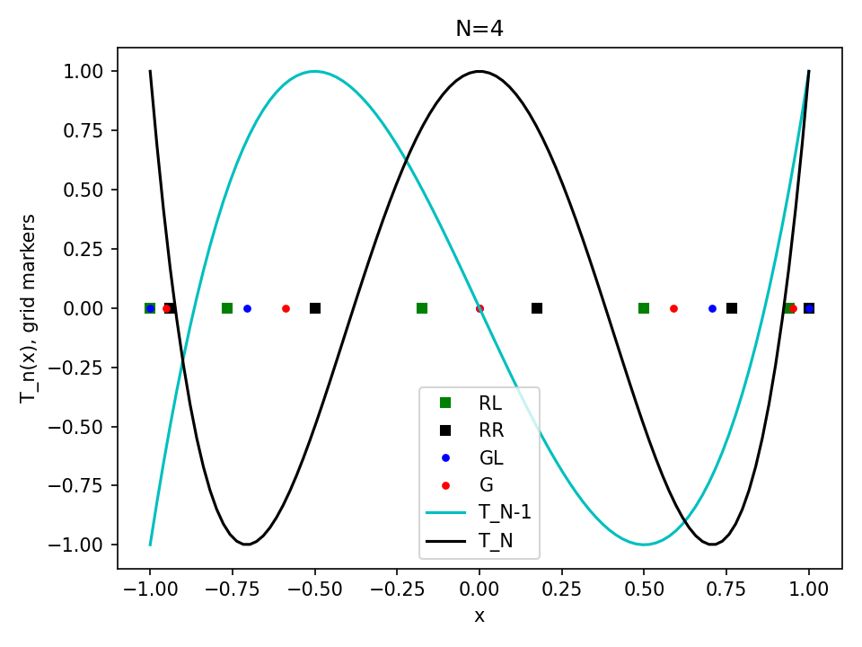

.. code-block:: python

   from pynalgo import grid_ChebyshevT, poly_ChebyshevT

   gr_GL = grid_ChebyshevT(4, variety="GL")   # includes both endpoints
   gr_G  = grid_ChebyshevT(4, variety="G")    # interior roots only
   gr_RR = grid_ChebyshevT(4, variety="RR")   # includes right endpoint
   gr_RL = grid_ChebyshevT(4, variety="RL")   # includes left endpoint

:file:`usage/chebyshev_grids.py`

----

Multi-Domain, exterior compactification: wave equation in spherical symmetry
^^^^^^^^^^^^^^^^^^^^^^^^^^^^^^^^^^^^^^^^^^^^^^^^^^^^^^^^^^^^^^^^^^^^^^^^^^^^^^^^^

Chebyshev pseudospectral discretization with interior (Radau-right) and
exterior (Radau-left) domains connected by C0/C1/C2 matching conditions.
Exterior compactification via logarithmic mapping
:math:`r = a + L\,\mathrm{arctanh}((x+1)/2)` compactifies
:math:`r \in [a, \infty)` to computational coordinate :math:`x \in [-1,1]`
(algebraic compactification also available as an alternative).  Orszag
filtering, RK4 evolution.

Chebyshev reconstruction of a test function across both domains:

.. figure:: _static/figs/wave_spherical_reconstruct.png
   :alt: Wave spherical reconstruction
   :align: center

Domain matching enforcing C0, C1, C2 continuity at the interface:

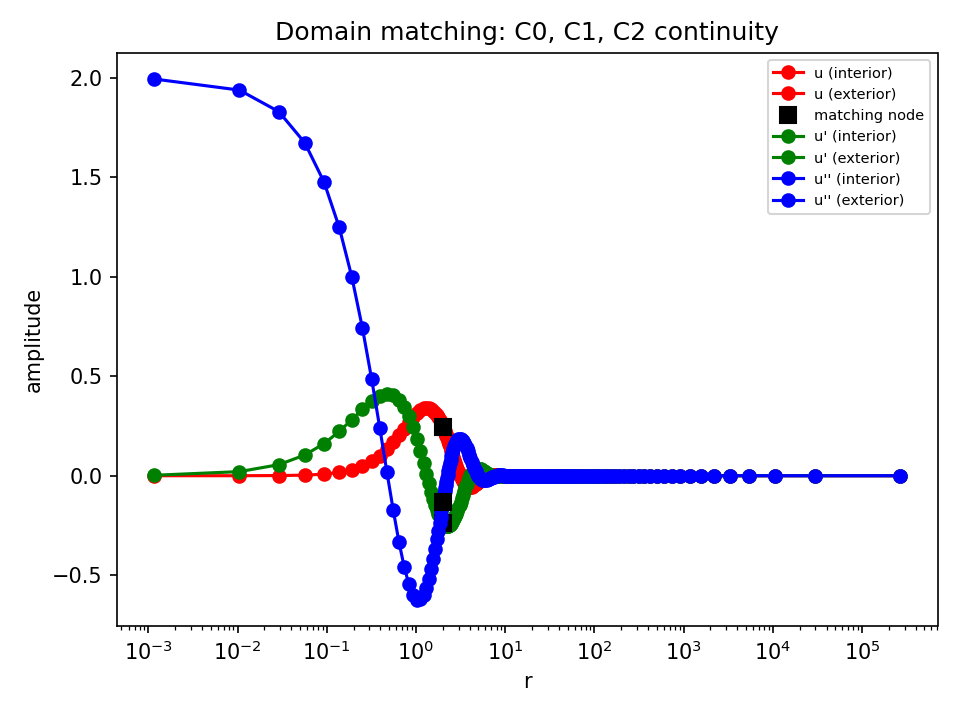

Spectral coefficient decay of the Laplacian -- diagnostic for resolution:

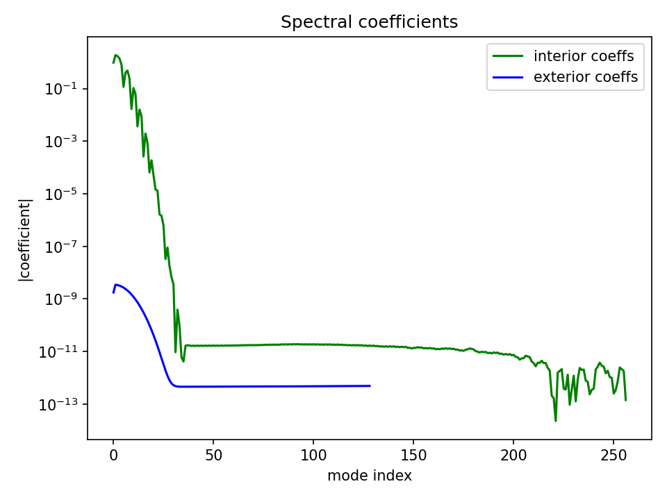

Spectral coefficients of the final field and its time derivative:

+-----------------------+-----------------------+
| u final coeffs        | v final coeffs        |
+-----------------------+-----------------------+
| |u_fin_coeffs|        | |v_fin_coeffs|        |
+-----------------------+-----------------------+

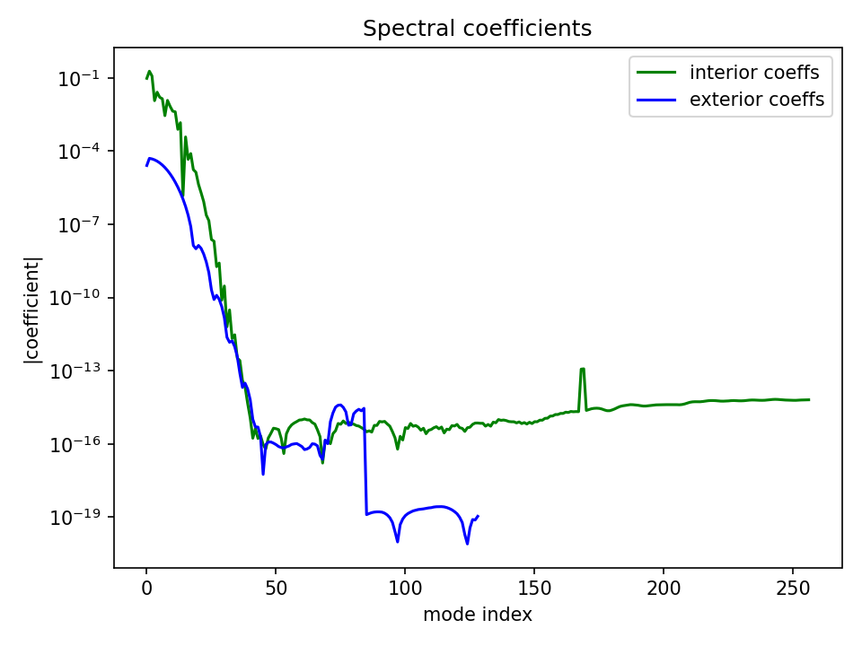

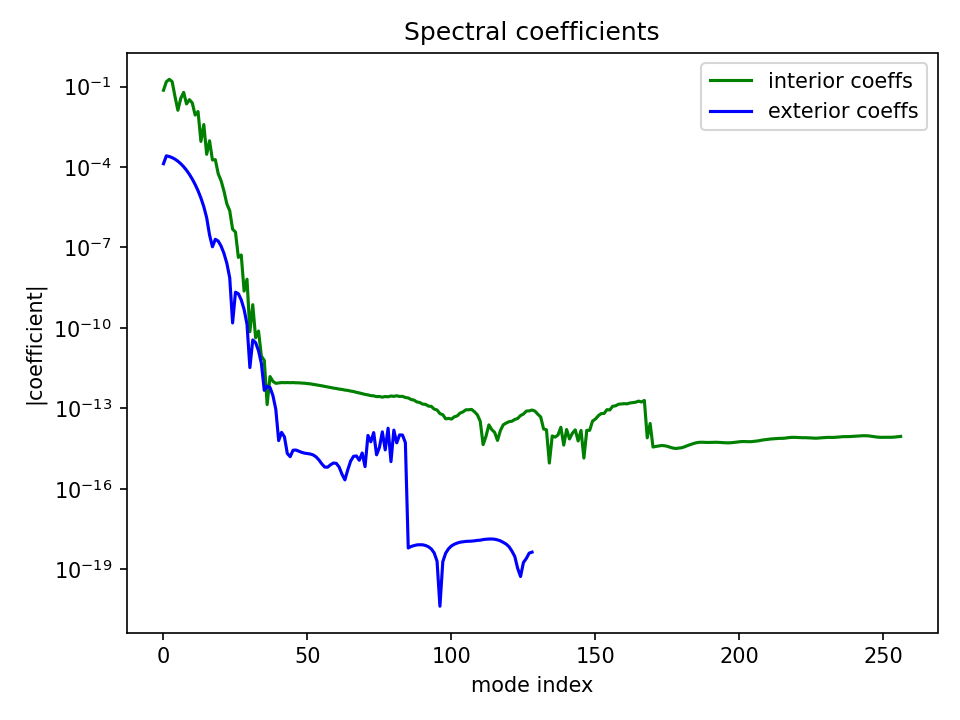

Wave evolution initial vs final profile after 10000-step RK4:

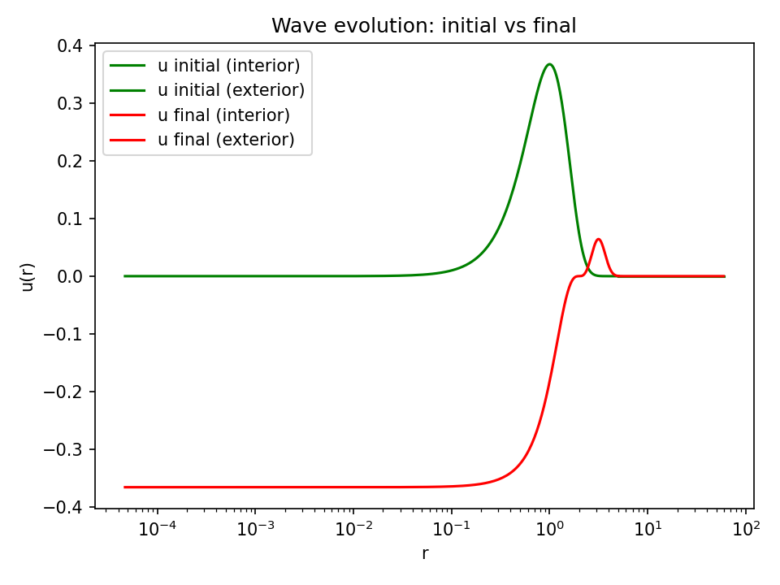

:file:`usage/wave_spherical_ps.py` -- features ``PseudospectralSphericalSymmetry``
class with parity decomposition, Orszag filtering, and domain matching.

----

Laplacian on S\ :sup:`2`\ : Parity-Split vs Domain-Extension
^^^^^^^^^^^^^^^^^^^^^^^^^^^^^^^^^^^^^^^^^^^^^^^^^^^^^^^^^^^^

Two approaches to the spherical Laplacian on Fourier grids:
parity decomposition (even/odd split) and domain extension
(double-cover trick).  Spherical harmonic test, RK4 wave evolution.

Spectral coefficients of the Laplacian operator (should be sparse
for spherical harmonics):

.. figure:: _static/figs/laplacian_s2_spectral.png
   :alt: Laplacian S2 spectral
   :align: center

Wave evolution final spectral coefficients:

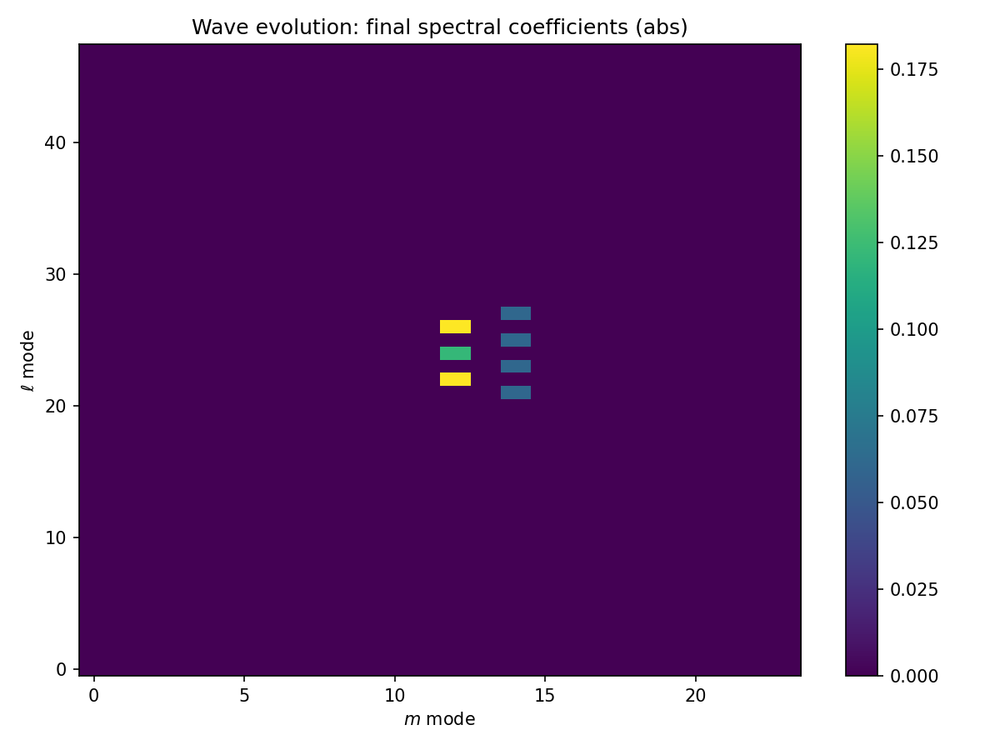

:file:`usage/laplacian_s2_ps.py`

----

AAA Rational Approximation Derivatives
^^^^^^^^^^^^^^^^^^^^^^^^^^^^^^^^^^^^^^

The AAA algorithm produces a barycentric rational approximant.
``rat_D1`` and ``rat_D2`` compute first and second derivatives via
three methods: Schneider-Werner divided differences (stable near
support nodes), quotient rule, and differentiation matrix.

.. figure:: _static/figs/rat_derivatives_demo.png
   :alt: AAA derivatives
   :align: center

Function (top-left), first derivative (top-right), second derivative
(bottom-left), absolute errors (bottom-right, semilogy).  The SW method
remains stable at near-coincident target/support points where the
quotient rule explodes.

:file:`usage/rat_derivatives.py`

----

Piecewise AAA with FunctionBlock
^^^^^^^^^^^^^^^^^^^^^^^^^^^^^^^^

Automatic domain fission: when AAA error exceeds tolerance, the domain
is bisected and AAA is re-run on each sub-interval.  Recursive tree
structure with overlap handling.

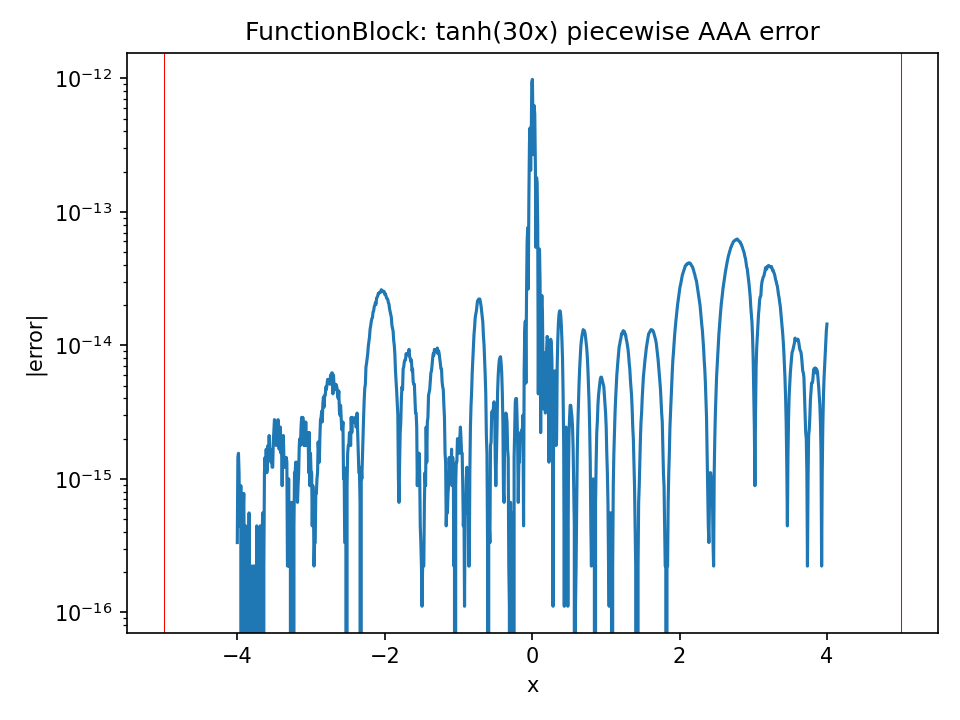

Error plot for tanh(30x) with four leaf blocks.  Red vertical lines
mark block boundaries.

:file:`usage/function_block.py` -- ``FunctionBlock`` class is a usage-level
demonstration, not part of core pynalgo.

----

Cartesian-to-Polar Coordinate Remap
^^^^^^^^^^^^^^^^^^^^^^^^^^^^^^^^^^^

Maps a planar function onto a polar grid using 1D AAA along radial
slices.  Demonstrates combining bilinear lookup with rational
approximation for coordinate transforms.

.. figure:: _static/figs/planar_remap.png
   :alt: Planar remap
   :align: center

Left: Cartesian source.  Right: polar remap with AAA interpolation
along each ray.

:file:`usage/planar_remap.py`

----

2D Dimension-Split Rational Interpolation
^^^^^^^^^^^^^^^^^^^^^^^^^^^^^^^^^^^^^^^^^

``interp_barycentric_2d_split`` performs Floater-Hormann interpolation
on tensor-product grids by splitting along each dimension.  The x-pass
produces intermediate values at target x-coordinates; the y-pass
interpolates those results to the full target grid.

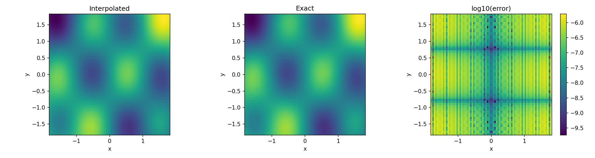

Interpolated field (left), exact analytic (center), log10 error (right).
80x60 target grid from 50x40 source grid with d=4 FH.

:file:`usage/dim2_split_interp.py`

----

Grid Clustering and Domain Mapping
^^^^^^^^^^^^^^^^^^^^^^^^^^^^^^^^^^

Three demonstrations of coordinate transforms for spectral methods:

Variable-Nph S2 cap -- azimuthal resolution scaled by sin(theta)
to maintain uniform point density on the sphere:

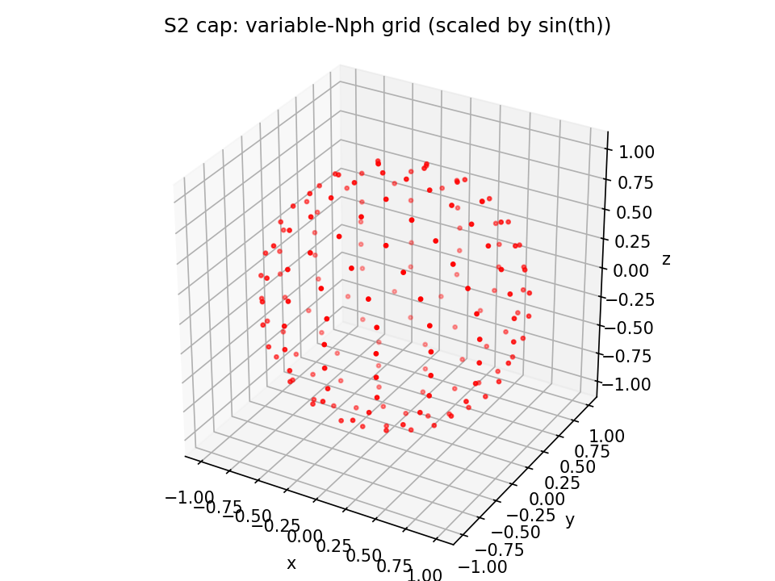

Spherical cap patch -- Chebyshev collocation on a rectangular
patch mapped to the sphere surface:

.. figure:: _static/figs/grid_interchange_s2cap.png
   :alt: Grid interchange S2 cap
   :align: center

Algebraic map to [0, infinity) -- Radau-left Chebyshev with
algebraic coordinate transform for semi-infinite domains.
Reconstruction of exp(-y):

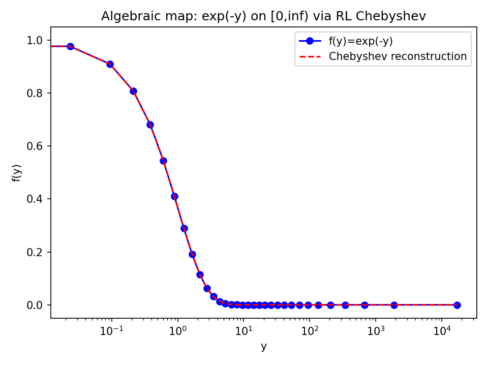

:file:`usage/grid_interchange.py`

----

Finite Difference Stencils via Banded Matrices
^^^^^^^^^^^^^^^^^^^^^^^^^^^^^^^^^^^^^^^^^^^^^^

Apply centered FD stencils using ``array_dot_bands``
with ghost-zone boundary padding:

.. code-block:: python

   from pynalgo import array_dense_from_bands, array_dense_to_banded, array_dot_bands

   bands = array([[-1/12, 2/3, 0, -2/3, 1/12]]) / ds   # 5-point stencil
   bands_full = array_dense_to_banded(array_dense_from_bands(bands, N))
   D1 = array_dot_bands(bands_full, f, axis=0)

:file:`usage/finite_difference.py`

API Summary
-----------

.. code-block:: python

   from pynalgo import (
       # Grids
       grid_ChebyshevT, grid_Fourier, grid_JacobiP, grid_LegendreP,
       # Quadrature
       quad_ChebyshevT, quad_Clenshaw_Curtis, quad_Fourier,
       quad_JacobiP, quad_LegendreP,
       # Differentiation
       diff_mat_nodal_ChebyshevT, diff_mat_nodal_Fourier, diff_mat_nodal_JacobiP,
       # Polynomials
       poly_ChebyshevT, poly_ChebyshevU, poly_ChebyshevV, poly_ChebyshevW,
       poly_Gegenbauer, poly_Ultraspherical, poly_LegendreP,
       poly_Laguerre, poly_Laguerre_lambda,
       poly_Hermite_psi, poly_Hermite_H,
       poly_sin, poly_cos,
       poly_der_ChebyshevT, poly_der_Gegenbauer, poly_der_Laguerre, ...,
       # Spectral transforms
       dct1, dct2, dct3, dct4, fft, ifft,
       # Rational approximation
       aaa, aaa_real, eval_rat, poles_residues,
       rat_D1, rat_D2, rat_D, rat_eval, diff_mat_nodal_rat,
       # Resample / interpolation
       interp_barycentric_1d, interp_barycentric_1d_generalized,
       interp_nn_1d, interp_lagrange_uniform, interp_barycentric_nd,
       Lebesgue_func,
       columns_interpolate, columns_smooth,
       lerp_1d, uniform_filter_1d, gaussian_filter_1d,
       extrap_Richardson, extrap_Richardson_err, interp_Neville,
       # Root finding
       chebyshev_proxy,
       # Linear algebra
       solver_tridiagonal, solver_pentadiagonal,
       # Number theory
       generate_primes, is_prime, get_prime_factors,
       prime_sqrt_decomp, gcd, lcm, next_pow2,
       # Utilities
       array_dot_2d_at_axis, array_dot_bands, array_dense_from_bands,
       arg_extremum_interval, ndarray_get_sorted_argmin,
       map_window_exp, ...
   )

Grid Variety Convention
-----------------------

+----------+---------------+------------+
| Variety  | Description   | Endpoints  |
+==========+===============+============+
| ``GL``   | Gauss-Lobatto | Both       |
+----------+---------------+------------+
| ``G``    | Gauss         | Neither    |
+----------+---------------+------------+
| ``RL``   | Radau-left    | x = -1     |
+----------+---------------+------------+
| ``RR``   | Radau-right   | x = +1     |
+----------+---------------+------------+

Fourier grids use: ``S1_CL``, ``S1_CR``, ``S1_I``, ``H1_C``, ``H1_I``,
``H1_S``.  Fourier differentiation adds cosine/sine variants.

Polynomial Hierarchy
--------------------

All Chebyshev kinds are computed via Jacobi polynomials with combinatorial
prefactors -- no direct three-term recursion.  Derivative identities use
shifted-parameter formulas (e.g., d\ :sup:`m`\ /dx\ :sup:`m`\  Gegenbauer =
2\ :sup:`m`\  * (lambda)\ :sub:`m`\  * C\ :sub:`n-m`\ :sup:`(lambda+m)`).
This guarantees consistency and avoids Gamma calls where possible.

Running Tests
-------------

.. code-block:: bash

   python -m pytest tests/                    # full test suite
   python -m pytest --doctest-modules pynalgo/  # doctests in source

Usage scripts produce figures and can be run individually:

.. code-block:: bash

   python usage/chebyshev_grids.py
   python usage/rat_derivatives.py
   # ... etc

License
-------

BSD-3-Clause.  Copyright Boris Daszuta.
